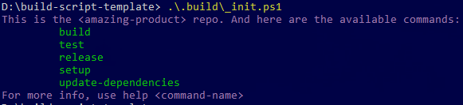

# build-script-template
This repo contain an example/template that could be used when adding a build script to a project.

## TL;DR

* We have a PowerShell script that runs the build. This script does everything, including gathering dependencies, generating version numbers, compiling, running tests, building and publishing NuGet packages. A build on TeamCity should, ideally, be a call to this script, and it should produce the same output as running it locally.
* We use [Invoke-Build](https://github.com/nightroman/Invoke-Build) as our 'make'.
* We have a `build\_init.ps1` script that defines the entry points for the PowerShell commands.
* We use [RedGate.Build](https://github.com/red-gate/RedGate.Build) as a useful library of build-related functions.


## The details

### .build\\\_init.ps1

* We standardize on a PowerShell script available at `.build\_init.ps1` which bootstraps our scripts.
  * `.build\_init.ps1` makes commands available in the PowerShell session.
  * `.build\_init.ps1` should display a list of available commands and show how to get help.
* Example output:



This means that any user not knowing what can be done with a new repo could just call `.build\_init.ps1` and get a list of commands available as well as how to get help.

```powershell
git clone git@github.com:red-gate/my-new-repo
cd my-new-repo
.build\_init.ps1
# expect to see what commands are available.
```

If you feel that `.build\_init.ps1` is horrible to type, you're probably right.
In that case, create a wrapper function in your PowerShell profile.
```powershell
function yo { .build\_init.ps1 }
```
Then you can do:
```powershell
git clone git@github.com:red-gate/my-new-repo
cd my-new-repo
yo
# expect to see what commands are available.
```

### .build folder
[.build/](.build) contains the bootstrapping script, build script(s) and their dependencies.
* [.build\\build.ps1](.build/build.ps1)
  * The actually build script. We use [Invoke-Build](https://github.com/nightroman/Invoke-Build) more and more but [psake](https://github.com/psake/psake) could also be used.
  * Tasks defined in the build script should be fairly simple and most shared code that is not specific to the current repo could be shared using [RedGate.Build](https://github.com/red-gate/RedGate.Build)
  * `.build\build.ps1` could also import other .ps1 files containing tasks.
    * `.build\build.vagrant.tasks.ps1`
    * `.build\build.tests.tasks.ps1`
    * etc.
* [.build\\paket.dependencies](.build/paket.dependencies)
  * The dependencies used by the build script. [More info on paket.dependencies](https://fsprojects.github.io/Paket/dependencies-file.html)
* `.build\paket.lock`
  * We can choose to commit this file or not.
    * If it is committed, paket dependencies will not change when calling `paket install`. What is defined in `paket.lock` is what gets installed.
    * If it is not committed, each call to `paket install` may download new versions based on the versions set in `paket.dependencies`
* [.build\\version.txt](.build/version.txt) (also see [RELEASENOTES.md](#releasenotesmd))
  * Contain the version number.
    * Could be *'major.minor'* (build script could add a 3rd dynamic number if need be)
    * Could be *'major.minor.patch'* (build script could add a 4th dynamic number if need be)

### .paket folder
[.paket/](.paket) contains the paket executables.
* `.paket\paket.bootstrapper.exe`
  * Used to download `.paket\paket.exe` (which we don't want to commit)
* `.paket\paket.exe`
  * Used to install the build script dependencies that are defined in [.build\\packet.dependencies](.build/packet.dependencies).

### NuGet.Config
* If you are using nuget to manage your solution's dependencies, [NuGet.Config](NuGet.Config) is used to define the list of nuget feeds to restore packages from.
* If you are using paket to manage your solution's dependencies, you do not need `NuGet.Config`. Instead these nuget sources can be defined in the root `paket.dependencies` file.
* Nuget feeds we use:
  * nuget.org
  * our own internal feed
  * our own internal teamcity feed

### RELEASENOTES.md
* [RELEASENOTES.md](RELEASENOTES.md)
  * Contains the full parseable release notes which can be used instead of version.txt to supply the version number of the build in addition to providing release notes for nuget package and more.
    * Could be *'major.minor'* (build script could add a 3rd (and 4th) dynamic number if need be)
    * Could be *'major.minor.patch'* (build script could add a 4th dynamic number if need be)
